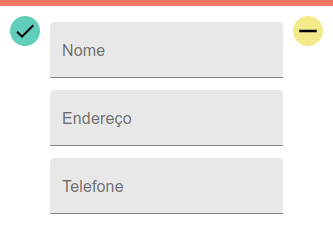
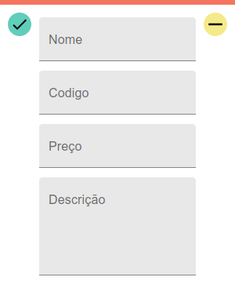
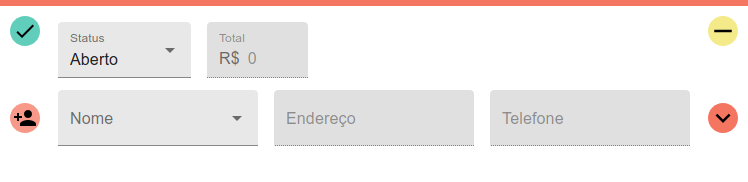
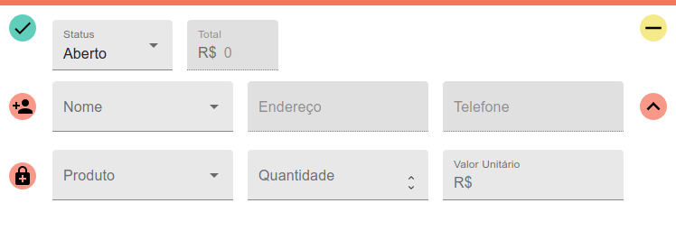

# Desafio DouraSoft
## Requisitos
* Node.js
* npm
* PostgreSQL
## Instalação
Os comandos a seguir foram utilizados no Ubuntu 18.04.5 . 
### Configurando o Banco de Dados
Acesse o cli do PostgreSQL.
```
sudo -u postgres psql
```
#### 1 - Criar Usuário
Caso já tenha um usuário para acessar o banco de dados, pode pular essa etapa e trocar o nome e senha utilizados no arquivo _**.env**_ na pasta _**server**_. 

Será criado um usuário com nome _**aless**_ e senha _**123**_
```
CREATE USER aless WITH PASSWORD '123';
```
#### 2 - Criar Database
A base de dados criada será chamada de _**transportadora**_, caso queira utilizar outro nome, basta trocar o nome no script abaixo e no arquivo _**.env**_
```
CREATE DATABASE transportadora;
GRANT ALL PRIVILEGES ON DATABASE "transportadora" to aless;
```
### Configurando o Servidor
Os comandos abaixo serão executados dentro da pasta _**server**_.
#### 1 - Preencher credenciais do Banco de Dados
No arquivo _**.env**_ na pasta _**server**_ preencha o campo _**DATABASE_USER**_ com o nome de usuário no banco de dados e o campo _**PASSWORD**_ com a senha desse usuário. No campo _**DATABASE**_ insira o nome da base de dados criada na etapa anterior.
```
HOST=localhost
DATABASE_PORT=5432
DATABASE_USER=aless
PASSWORD=123
DATABASE=transportadora
```
#### 2 - Instalar Dependências
```
~/server$ npm install
```
#### 3 - Executar
```
~/server$ npm start
```
## Views
A aplicação utilizando react já está configurada para ser servida através do servidor iniciado anteriormente. 
Ela pode ser acessada em _http://localhost:5000_
### Ações Padronizadas
#### Salvar Registro Criado

#### Atualizar

#### Deletar

### Clientes
#### Botão de Criar

##### Template Gerado


Nome e Endereço são obrigatórios.
### Produtos
#### Botão de Criar

##### Template Gerado

### Pedidos
#### Botão de Criar

#### Template Gerado

#### Template Expandido


O cliente pode ser escolhido de uma lista ou criado com o pedido. Para isso, é necessário clicar no botão ao lado permitindo a edição completa dos campos.

Para adicionar itens a lista de produtos, clique no botão de expandir e utilize o botão de adicionar produtos.

O total mostrado é igual ao valor informado pela API, quando não se carregou a lista de produtos, caso contrário o total fica de acordo com a lista de produtos.

Caso a lista de produtos não tenha sido carregada, atualizações não serão realizadas nela.

## CRUD API
### Cliente
#### Formato na Base de Dados
|id|nome|endereco|telefone|
|---|---|---|---|
#### Create
###### Method _POST_ 
###### URI _http://localhost:5000/api/clientes/:id_
Os atributos _**nome**_ e _**endereco**_ são obrigatórios e não podem conter strings vazias, _**telefone**_ é opcional.
##### Body
```json
{
    "nome": "Ariel Pereira",
    "endereco": "Rua Osório Nunes Siqueira, 42",
    "telefone": "67 98765-4321"
}
```
##### Resposta
```json
{
    "id": 16,
    "nome": "Ariel Pereira",
    "endereco": "Rua Osório Nunes Siqueira, 42",
    "telefone": "67 98765-4321"
}
```
#### Retrieve One
###### Method _GET_ 
###### URI _http://localhost:5000/api/clientes/:id_
##### Resposta
```json
{
    "id": 16,
    "nome": "Ariel Pereira",
    "endereco": "Rua Osório Nunes Siqueira, 42",
    "telefone": "67 98765-4321"
}
```
#### Retrieve All
###### Method _GET_ 
###### URI _http://localhost:5000/api/clientes/_
##### Resposta
```json
[
    {
        "id": 16,
        "nome": "Ariel Pereira",
        "endereco": "Rua Osório Nunes Siqueira, 42",
        "telefone": "67 98765-4321"
    },
    {
        "id": 11,
        "nome": "João",
        "endereco": "Jasmim",
        "telefone": ""
    },
    {
        "id": 10,
        "nome": "Eva",
        "endereco": "Oso",
        "telefone": ""
    },
    {
        "id": 7,
        "nome": "Elizete",
        "endereco": "Rua Osório",
        "telefone": "55 67 99924-5974"
    }
]
```
#### Update
###### Method _PATCH_ 
###### URI _http://localhost:5000/api/clientes/:id_
##### Before
Utilizando o mesmo exemplo em _**Retrieve One**_
##### Body
```json
{
    "nome": "Ariel Carlos",
    "telefone": "67 3457-1896"
}
```
##### Resposta
```json
{
    "id": 16,
    "nome": "Ariel Carlos",
    "endereco": "Rua Osório Nunes Siqueira, 42",
    "telefone": "67 3457-1896"
}
```
#### Delete
###### Method _DELETE_ 
###### URI _http://localhost:5000/api/clientes/:id_
##### Resposta
```json
{  
    "message": "Cliente Removido"
}
```
### Produto
#### Formato na Base de Dados
|id|nome|preco|codigo|descricao|
|---|---|---|---|---|
#### Create
###### Method _POST_ 
###### URI _http://localhost:5000/api/produtos/_
Os atributos _**nome**_ e _**codigo**_ são obrigatórios e não podem conter strings vazias, __**preco**__ também é obrigatório, somente _**descricao**_ não é.
##### Body
```json
{
    "nome": "Café",
    "codigo": "#12358",
    "preco": 5.45
}
```
##### Resposta
```json
{
    "id": 7,
    "nome": "Café",
    "codigo": "#12358",
    "preco": 5.45,
    "descricao": null
}
```
#### Retrieve One
###### Method _GET_ 
###### URI _http://localhost:5000/api/produtos/:id_
##### Resposta
```json
{
        "id": 5,
        "codigo": "#145",
        "descricao": "Choco Love",
        "preco": 17.8,
        "nome": "Chocolate"
    }
```
#### Retrieve All
###### Method _GET_ 
###### URI _http://localhost:5000/api/produtos/_
##### Resposta
```json
[
    {
        "id": 7,
        "codigo": "#12358",
        "descricao": null,
        "preco": 5.45,
        "nome": "Café"
    },
    {
        "id": 5,
        "codigo": "#145",
        "descricao": "Choco Love",
        "preco": 17.8,
        "nome": "Chocolate"
    }
]
```
#### Update
###### Method _PATCH_ 
###### URI _http://localhost:5000/api/produtos/:id_
##### Before
```json
{
    "id": 7,
    "codigo": "#12358",
    "descricao": null,
    "preco": 5.45,
    "nome": "Café"
}
```
##### Body
```json
{  
    "descricao": "Cafeína"
}
```
##### Resposta
```json
{
    "id": 7,
    "codigo": "#12358",
    "descricao": "Cafeína",
    "preco": 5.45,
    "nome": "Café"
}
```
#### Delete
###### Method _DELETE_ 
###### URI _http://localhost:5000/api/produtos/:id_
##### Resposta
```json
{  
    "message": "Produto Removido"
}
```
### Pedido
#### Formatos na Base de Dados

##### Pedidos
|id|clienteId|data|status|
|---|---|---|---|

##### Mapeamento da relação entre Pedidos e Produtos
|id|produtoId|pedidoId|valorUnitario|quantidade|
|---|---|---|---|---|

#### Create
###### Method _POST_ 
###### URI _http://localhost:5000/api/pedidos/_
Os atributos _**clienteId**_ e _**produtos**_ são obrigatórios. O atributo _**status**_ é gerado no valor "Aberto" caso não seja informado, o atributo aceita apenas os valores "Aberto", "Entregue" e "Cancelado". A _**data**_ é inicializada com a data de criação do pedido e não pode ser alterada.

O atributo _**produtos**_ deve conter uma lista, vazia ou não, com itens na seguinte maneira. Caso o atributo _**valorUnitario**_ não seja informado, ele será preenchido com o preço padrão do produto.
##### Formato de _produto_
```json
{  
    "quantidade": 2,
    "produtoId": 1,
    "valorUnitario": 17
}
```
##### Body
```json
{
    "clienteId":7,
    "produtos":[{"produtoId": 5, "quantidade": 4}]
}
```
##### Resposta
```json
{
    "data": "2020-10-20T13:56:09.226Z",
    "id": 19,
    "status": "Aberto",
    "valorTotal": 71.2,
    "cliente": {
        "id": 7,
        "nome": "Elizete",
        "endereco": "Rua Osório",
        "telefone": "55 67 99924-5974"
    },
    "produtos": [
        {
            "produto": {
                "id": 5,
                "codigo": "#145",
                "descricao": "Choco Love",
                "preco": 17.8,
                "nome": "Chocolate"
            },
            "quantidade": 4,
            "valorUnitario": 17.8
        }
    ]
}
```
#### Retrieve All
###### Method _GET_ 
###### URI _http://localhost:5000/api/pedidos/_
A lista de produtos em cada pedido não é repassada.
##### Resposta
```json
[
    {
        "id": 19,
        "data": "2020-10-20T13:56:09.226Z",
        "status": "Aberto",
        "valorTotal": 71.2,
        "cliente": {
            "id": 7,
            "nome": "Elizete",
            "endereco": "Rua Osório",
            "telefone": "55 67 99924-5974"
        }
    },
    {
        "id": 15,
        "data": "2020-10-20T10:24:38.067Z",
        "status": "Aberto",
        "valorTotal": 17.8,
        "cliente": {
            "id": 9,
            "nome": "Aleim",
            "endereco": "Internet",
            "telefone": "554"
        }
    },
    {
        "id": 14,
        "data": "2020-10-20T10:23:45.531Z",
        "status": "Aberto",
        "valorTotal": 15,
        "cliente": {
            "id": 11,
            "nome": "João",
            "endereco": "Jasmim",
            "telefone": ""
        }
    }
]
```
#### Retrieve One
###### Method _GET_ 
###### URI _http://localhost:5000/api/pedidos/:id_
##### Resposta
```json
{
    "id": 19,
    "data": "2020-10-20T13:56:09.226Z",
    "status": "Aberto",
    "valorTotal": 68,
    "cliente": {
        "id": 7,
        "nome": "Elizete",
        "endereco": "Rua Osório",
        "telefone": "55 67 99924-5974"
    },
    "produtos": [
        {
            "quantidade": 4,
            "valorUnitario": 17,
            "produto": {
                "id": 5,
                "codigo": "#145",
                "descricao": "Choco Love",
                "preco": 17.8,
                "nome": "Chocolate"
            }
        }
    ]
}
```
#### Update
###### Method _PATCH_ 
###### URI _http://localhost:5000/api/pedidos/:id_
Os atributos _status_, _clienteId_, e a lista _produtos_ podem ser atualizadas. Caso o atributo não seja passado ele não será atualizado.
##### Before
Utilizando o pedido em __Retrieve One__.
##### Body
```json
{
    "produtos":[{"produtoId":5, "quantidade":4, "valorUnitario":11}]
}
```
##### Resposta
```json
{
    "id": 19,
    "data": "2020-10-20T13:56:09.226Z",
    "status": "Aberto",
    "valorTotal": 44,
    "cliente": {
        "id": 7,
        "nome": "Elizete",
        "endereco": "Rua Osório",
        "telefone": "55 67 99924-5974"
    },
    "produtos": [
        {
            "produto": {
                "id": 5,
                "codigo": "#145",
                "descricao": "Choco Love",
                "preco": 17.8,
                "nome": "Chocolate"
            },
            "quantidade": 4,
            "valorUnitario": 11
        }
    ]
}
```
#### Delete 
###### Method _DELETE_ 
###### URI _http://localhost:5000/api/pedidos/:id_
##### Resposta
```json
{  
    "message": "Pedido Removido"
}
```